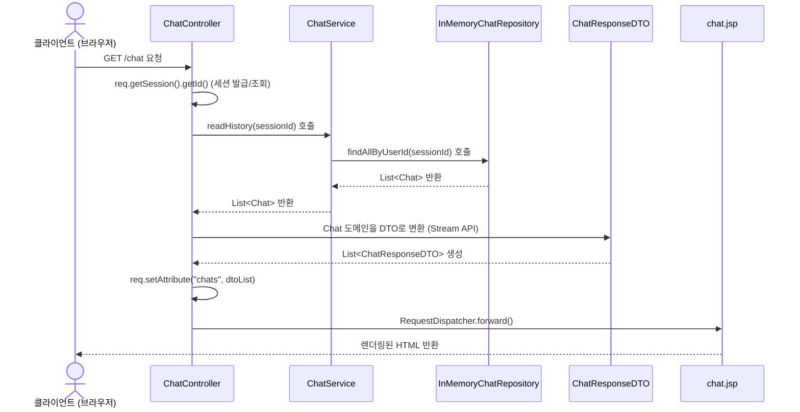
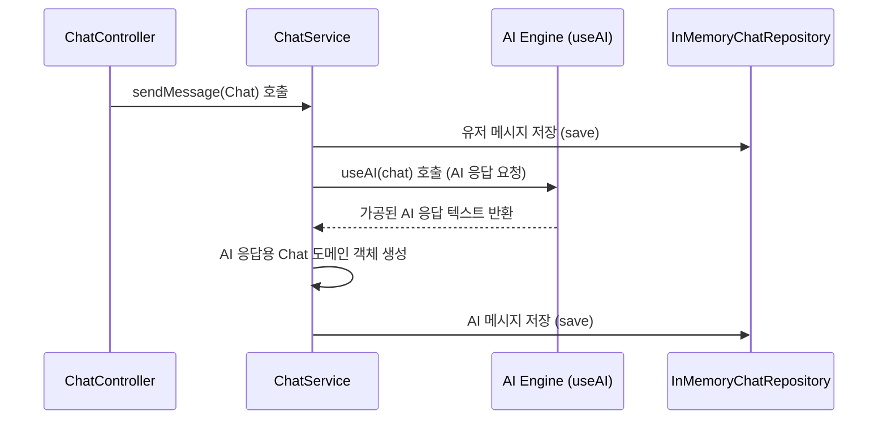

# ArChat 데이터 흐름 및 프로젝트 구조

## 1. 아키텍처 개요
ArChat 프로젝트는 Java Servlet을 기반으로 한 MVC (Model-View-Controller) 아키텍처에 비즈니스 로직(Service)과 데이터 접근 로직(Repository)을 분리한 **계층형 아키텍처**를 따르고 있습니다.

- **Controller (컨트롤러)**: 클라이언트의 HTTP 요청을 처리하고, 데이터를 가공한 후 View로 화면 렌더링을 위임합니다.
- **Service (서비스)**: 컨트롤러의 요청을 받아 핵심 비즈니스 로직(AI 호출, 데이터 검증 등)을 처리합니다.
- **Repository (레포지토리)**: 데이터베이스 및 영속성 계층과의 통신을 추상화하여 담당합니다. (현재는 메모리 기반)
- **Model (도메인/DTO)**: 시스템 내에서 이동하는 데이터의 형태를 정의합니다.
- **View (뷰)**: 서버에서 전달된 데이터를 기반으로 최종 HTML 화면(JSP)을 렌더링합니다.

---

## 2. 컴포넌트별 주요 역할

| 계층 | 클래스 / 파일 | 역할 |
|---|---|---|
| **Controller** | `ChatController.java` | `/chat` 요청 처리. 세션 기반 사용자 식별 및 화면 포워딩 |
| | `BaseController.java` | 뷰 경로 접두사(`/WEB-INF/views`) 등 공통 서블릿 로직 제공 |
| **DTO** | `ChatResponseDTO.java` | 화면(View)에 필요한 정보만 추려낸 데이터 전송 객체 |
| **Service** | `ChatService.java` | AI 연동, 메시지 저장 처리, 유저별 채팅 이력 반환 등 핵심 비즈니스 로직 |
| **Repository**| `ChatRepository.java` | 데이터 관리 규격을 정의하는 인터페이스 |
| | `InMemoryChatRepository.java` | `ConcurrentHashMap`을 활용한 메모리 기반 채팅 데이터 저장소 (`ChatRepository` 구현체) |
| **Model** | `Chat.java` | 실제 채팅 데이터(메시지, 송신자, Timestamp 등)를 담는 도메인 레코드 |
| **View** | `chat.jsp` | 응답 데이터를 표출하는 JSP 화면 |

---

## 3. 주요 데이터 흐름 (Data Flow)

### 3.1. 채팅 내역 조회 흐름 (GET `/chat`)
클라이언트가 최초로 채팅 페이지에 접속했을 때의 데이터 흐름입니다.

### 3.2. 메시지 전송 및 처리 흐름 (Service 계층 내부 로직)
유저가 메시지를 보냈을 때 `ChatService`에서 동작하는 데이터 흐름입니다. (향후 Controller의 POST 요청을 통해 연결 예정)

