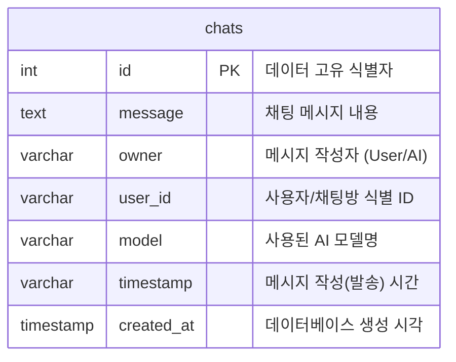

# Database Schema (Supabase)

이 문서는 프로젝트 내에서 사용하고 있는 Supabase 데이터베이스의 테이블 구조를 설명합니다.

## ERD (Entity Relationship Diagram)
마크다운을 지원하는 뷰어(예: GitHub, IntelliJ 등)에서 아래의 Mermaid 다이어그램을 통해 ERD를 시각적으로 확인할 수 있습니다.



## `chats` 테이블
채팅 내역(사용자 질문 및 AI 응답)을 저장하는 테이블입니다.

### 테이블 스키마

| 컬럼명 (Column) | 데이터 타입 (Type) | 제약 조건 (Constraints) | 설명 |
| :--- | :--- | :--- | :--- |
| **`id`** | `SERIAL` | `PRIMARY KEY` | 데이터 고유 식별자 (자동 증가 번호) |
| **`message`** | `TEXT` | | 채팅 메시지 내용 |
| **`owner`** | `VARCHAR(255)` | | 메시지 작성자 구분 (`User` 또는 `AI`) |
| **`user_id`** | `VARCHAR(255)` | | 사용자/채팅방을 식별하는 고유 ID |
| **`model`** | `VARCHAR(255)` | | 사용된 AI 모델명 (예: `gemini`, `gemma`) |
| **`timestamp`** | `VARCHAR(100)` | | 메시지 작성(발송) 시간 (문자열 타입) |
| **`created_at`**| `TIMESTAMP WITH TIME ZONE` | `DEFAULT NOW()` | 데이터베이스에 레코드가 생성된 실제 시각 |

### 생성용 SQL 문

Supabase 대시보드의 **SQL Editor**에서 아래 쿼리를 실행하여 테이블을 생성할 수 있습니다.

```sql
CREATE TABLE chats (
    id SERIAL PRIMARY KEY,
    message TEXT,
    owner VARCHAR(255),
    user_id VARCHAR(255),
    model VARCHAR(255),
    timestamp VARCHAR(100),
    created_at TIMESTAMP WITH TIME ZONE DEFAULT NOW()
);
```
